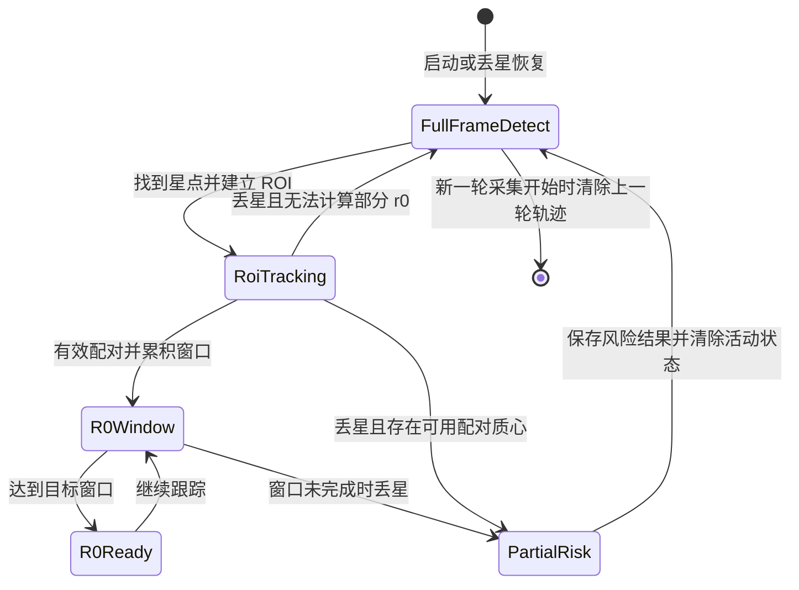

# 对准、丢星恢复与 r0 计算修改规格

## 1. 修改范围

本规格只描述本次已经修改的代码行为：

- ROI 跟踪丢星后的质心和 r0 计算流程；
- 重新找到星点后的 r0 窗口重建；
- 候选星编号稳定；
- 对准模式的北极星当前轨迹位置；
- 全画幅预览中的 ROI 运动轨迹和拟合轨迹；
- 部分窗口 r0 的风险标记与结果保存。

启动速度和触发器本地/远程切换问题不属于本次修改范围。

## 2. 丢星与 r0 计算流程

### 2.1 正常运行

```text
全画幅识别星点
    -> 找到目标星点
    -> 建立 ROI
    -> ROI 高速跟踪
    -> 双相机质心配对
    -> 累积当前 r0 计算窗口
    -> 达到窗口帧数后计算并发布 r0
```

### 2.2 ROI 跟踪中丢星

```text
ROI 高速跟踪
    -> 判定星点丢失
    -> 根据丢星前已有配对质心尝试计算部分 r0
    -> 保存历史结果
    -> 清除活动配对状态和活动计算窗口
    -> 退出 ROI
    -> 恢复低速全画幅识别
```

丢星时：

1. 已经计算出的 r0、质心、配对结果和其他参数保留为历史记录。
2. 上一段质心不参与重新找到星点后的计算。
3. 不删除历史记录；只清除内存中用于后续计算的活动状态。
4. 如果已有至少两个有效配对质心，可以计算部分 r0；该结果必须标记为风险。
5. 如果配对质心不足以计算 r0，则不输出有效 r0 数值。

### 2.3 重新找到星点

```text
全画幅识别
    -> 重新找到目标星点
    -> 建立 ROI
    -> 第一个有效双相机配对帧作为新窗口第 1 帧
    -> 重新累积 r0 窗口
```

重新找到星点后：

- 不复用丢星前活动窗口中的质心；
- 新窗口从第一个有效配对帧重新开始；
- 历史 r0 和历史质心仍可保存和查询。

### 2.4 新窗口未完成时再次丢星

```text
重新找到星点
    -> 新 r0 窗口累积中
    -> 再次丢星且窗口未完成
    -> 使用当前窗口已有配对质心计算 r0
    -> 发布风险结果
    -> 清除当前活动窗口
    -> 回到全画幅识别
```

风险结果必须包含：

- r0 数值；
- 当前实际配对质心数；
- 目标窗口帧数；
- 风险标志。

## 3. ROI 重新居中规则

ROI 中心更新或 ROI 重新居中不等同于丢星。

ROI 重新居中时：

1. 重置临时配对同步状态，避免新旧 ROI 的帧配对错位。
2. 保留当前差分历史和 r0 活动窗口。
3. 继续使用当前窗口累积质心和计算 r0。

只有明确发生丢星并进入全画幅重定位时，才结束当前活动窗口并为重新找到星点建立新窗口。

## 4. 候选星编号稳定流程

```text
当前帧检测候选星
    -> 与上一帧候选星按位置匹配
    -> 匹配成功：沿用上一帧编号
    -> 无法匹配：分配新编号
    -> 更新候选星叠加显示
```

具体规则：

1. 候选列表每帧重新排序时，不直接把列表位置当作稳定编号。
2. 同一星点在亮度变化或排序变化后，继续使用原编号。
3. 新出现且无法与旧候选匹配的星点，分配新的编号。
4. 已确认目标优先根据上一目标位置匹配当前候选，避免亮度变化后选中其他星点。
5. 实时重定位时，优先选择距离上一次目标位置最近的候选星。

## 5. 对准模式北极星轨迹

### 5.1 轨迹锚点

对准模式确认北极星后，将确认位置作为当前相机的轨迹锚点，并记录确认时间。

相机 1 和相机 2 的轨迹锚点分别保存，不能强制两个相机使用同一个图像坐标中心。

### 5.2 当前时段位置

对准模式根据：

- 已确认的北极星位置；
- 当前轨迹中心；
- 确认时间与当前时间的时间差；
- 恒星日周期；

计算当前时刻北极星在轨迹上的位置。

由于望远镜画面为倒像，显示坐标采用镜像后的顺时针旋转方向。

### 5.3 对准模式显示内容

对准模式显示：

- 北极星运动轨迹；
- 当前时刻模拟位置；
- 当前轨迹时间；
- 轨迹角度和位置偏差。

当前时刻模拟星点只在对准模式中显示。

## 6. 全画幅预览轨迹

### 6.1 ROI 轨迹点

每次 ROI 中心发生变化时，将新的 ROI 中心追加到当前自动采集轮次的轨迹列表，并在全画幅画布中显示相邻 ROI 中心的连线。

轨迹点用于表示实际跟踪到的 ROI 运动，不使用对准模式的模拟当前星点。

### 6.2 轨迹拟合

当轨迹点达到拟合要求后，根据已有 ROI 中心点拟合运动轨迹圆，并在全画幅预览中显示。

轨迹点不足以拟合圆时，只显示已采集的 ROI 中心连线，不显示拟合圆。

全画幅预览不显示：

- 对准模式的当前模拟北极星位置；
- 仅由时间模型推算出的模拟星点标记。

### 6.3 轨迹清理

- 同一轮自动采集中，丢星前后的 ROI 轨迹继续保留并追加。
- 新一轮采集开始时，清除上一轮轨迹。
- 进入对准模式开始流程时，清除全画幅画布上遗留的采集轨迹。

## 7. r0 风险结果

部分窗口 r0 结果在 UI 和结果文件中都必须可识别：

- UI 数值显示风险标志；
- 状态信息说明实际配对数小于目标窗口帧数；
- 结果文件保存风险字段和实际样本数；
- 后续新窗口不得自动吸收该风险窗口的数据。

## 8. 本次修改后的主流程


