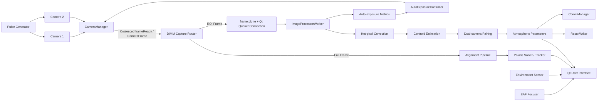

<div align="center">

# DIMM

### 基于 Qt / OpenCV 的双相机差分像运动监测与自动对准系统

用于双相机星点采集、质心测量、差分像运动统计、大气视宁度参数计算、自动曝光控制和北极星对准的 Windows 桌面应用。

[](https://isocpp.org/)
[](https://www.qt.io/)
[](https://opencv.org/)
[](#运行环境)
[](#项目状态)

</div>

> [!IMPORTANT]
> 当前推荐开发目录为 **`src82/`**。  
> `src731质心算法/` 等目录主要保留算法演进过程和历史实现，不建议作为新功能开发入口。

---

## 项目简介

DIMM（Differential Image Motion Monitor，差分像运动监测仪）通过同步观测两个星像光斑，计算它们的相对位置变化，并根据差分像运动方差估计大气湍流相关参数。

本项目在传统 DIMM 测量流程基础上，集成了双相机控制、硬件触发、ROI 跟踪、星点质心计算、自动曝光、北极星识别与对准、环境传感器、自动调焦器、数据记录和 TCP 上报等功能，面向实验室验证、外场观测和算法研究。

### 当前主线能力

- 双相机连接、参数配置和连续/硬件触发采集
- 全画幅定位与固定尺寸 ROI 跟踪
- 双路星点质心测量与时间戳配对
- 纵向/横向差分像运动统计
- `r0`、Seeing、`θ0`、`τ0` 等参数计算
- 热像素 Mask / Excess 模板修正
- 稳健峰值检测和自动曝光状态机
- 北极星自动识别、星表匹配和局部跟踪
- 温湿压传感器、EAF 自动调焦器和脉冲发生器接入
- CSV 测量结果、详细质心数据和运行统计输出
- TCP 二进制协议测量结果上报

---

## 界面预览

仓库尚未放置正式截图。建议将主界面截图保存为：

```text
docs/images/main-window.png
```

然后取消下面的注释：

<!--
<div align="center">
  
</div>
-->

---

## 系统架构



### 数据处理流程

```text
相机回调
  → CameraManager 保存最新 CameraFrame 并合并重复 frameReady 通知
  → DIMM 取得当前帧并路由
  → ImageProcessor 深拷贝图像并按 Qt 队列顺序提交
  → 采集代次和 Frame ID 检查
  → 全画幅定位或 ROI 图像处理
  → 热像素修正
  → 质心计算与质量判断
  → 双相机样本配对
  → 差分像运动统计
  → 大气参数计算
  → UI、CSV 和网络输出
```

---

## 核心功能

### 1. 双相机采集

`CameraManager` 负责设备枚举、连接、曝光、增益、帧率、触发方式、流控制和硬件 ROI 操作。

支持的采集模式包括：

| 模式 | 说明 |
|---|---|
| 连续采集 | 相机按照配置帧率持续输出 |
| 硬件触发 | 两台相机接收统一脉冲源，适合双路同步测量 |
| 对准模式 | 使用低速全画幅预览进行北极星识别和光轴调整 |

### 2. ROI 定位与跟踪

实时采集流程采用“全画幅定位 → 双相机 ROI 建立 → ROI 跟踪”的方式：

1. 使用低频全画幅图像搜索星点；
2. 两台相机均获得有效位置后建立固定尺寸 ROI；
3. 正常测量阶段只处理 ROI 图像；
4. 星点接近 ROI 边缘时触发重居中；
5. 星点持续丢失时回到全画幅重新定位。

> ROI 更新涉及相机停流、Offset 对齐、双相机同步和采集代次管理。修改相关代码前，请完整检查 `DIMM.LiveRoi.cpp`、`CameraManager` 和 `ImageProcessor` 的调用链。

### 3. 质心计算

项目当前提供两类 ROI 质心算法。

#### 阈值重心法

先估计背景和噪声，再对超过阈值的有效像素进行背景扣除加权：

```text
weight(x, y) = max(I(x, y) - background, 0)

centroid_x = Σ[x · weight(x, y)] / Σ[weight(x, y)]
centroid_y = Σ[y · weight(x, y)] / Σ[weight(x, y)]
```

动态阈值可由以下参数共同决定：

```text
max(minimumIntensity, background + sigmaMultiplier × noiseSigma)
```

#### 局部峰值小核法

1. 搜索具有邻域支撑的可信峰值；
2. 拒绝孤立亮点和强固定热像素；
3. 在峰值附近的小窗口中计算质心；
4. 支持强度重心和二维高斯拟合两种方式。

核心实现位于：

```text
src82/ImageProcessor.cpp
src82/CentroidLogic.h
src82/AutoExposureLogic.h
```

### 4. 热像素修正

项目使用两类模板：

- **Mask**：标记固定热像素位置；
- **Excess**：记录热像素相对正常响应的超额 DN。

ROI 处理阶段只缓存当前 ROI 对应的模板区域，避免每帧重复读取完整文件。北极星全画幅求解也具有独立模板缓存。

### 5. 自动曝光

自动曝光不是简单地使用单个最大像素，而是先判断峰值是否具有合理的邻域支撑。

主要指标包括：

- 支撑峰值及其百分位值
- 峰值邻域像素数量
- 孤立峰值拒绝结果
- 硬饱和像素数量
- 有效质心比例
- 亮帧、暗帧和稳定帧比例
- 双相机趋势一致性
- 星点丢失比例

状态机包括：

```text
Normal
BrightWarning
BrightAdjusting
DarkWarning
DarkAdjusting
Cooldown
StarLost
TrendConflict
```

自动曝光会限制单次变化比例、最小曝光变化量和调整后的稳定等待时间，避免在云层、热像素、抖动或双相机趋势冲突时频繁振荡。

### 6. 帧通知与顺序提交线程模型

当前 `src82` 采用两层职责明确的帧传递方式。

#### CameraManager：第一层实时通知合并

相机 SDK 回调到达后，`CameraManager` 保存该相机当前最新的 `CameraFrame`。如果已有一个 `frameReady` 通知尚未被上层消费，则不会继续重复投递同类通知。

```text
相机 SDK 回调连续到达
  → 更新 CameraManager 中的最新 CameraFrame
  → 同一相机仅保留一个待消费的 frameReady 通知
  → DIMM 收到通知后取得当前最新帧
```

这一层用于避免相机回调把 GUI/路由事件队列无限填满。它并不保证每个物理相机回调都进入上层处理。

#### ImageProcessor：恢复顺序排队提交

DIMM 将一帧交给 `ImageProcessor::processFrame()` 后，`ImageProcessor` 会先进行深拷贝，再通过 `Qt::QueuedConnection` 投递给独立 Worker：

```cpp
cv::Mat frameCopy = frame.clone();

QMetaObject::invokeMethod(
    m_worker,
    "processFrame",
    Qt::QueuedConnection,
    Q_ARG(int, cameraIndex),
    Q_ARG(cv::Mat, frameCopy),
    Q_ARG(quint64, frameId),
    Q_ARG(quint64, cameraTimestamp),
    Q_ARG(quint64, acquisitionGeneration));
```

因此：

- 不再存在 `PendingFrameSlot`；
- 不再存在 `processLatestFrameLoop()`；
- 不在 `ImageProcessor` 内分别覆盖两台相机的待处理帧；
- 每次被 `ImageProcessor` 接受的调用都会按 Qt 事件队列顺序提交；
- `frameId`、相机时间戳和 acquisition generation 会随图像一起传递；
- Worker 仍通过 generation 检查拒绝采集切换前的旧帧。

该模型恢复了 `src731质心算法` 已经过实机长时间验证的提交行为，更有利于保持双相机 FrameID 的到达顺序和配对完整性。

需要注意：如果 Worker 长时间处理不过来，Qt 队列仍可能增长。因此实机验证应同时观察处理延迟、停止响应时间和内存占用趋势。

### 7. 北极星对准

对准模式包含：

- 全画幅星点检测；
- 北天极附近星表匹配；
- 相似变换和镜像候选求解；
- 北极星候选确认；
- 自动求解失败后的重试；
- 手动候选选择；
- 已确认目标的局部窗口跟踪；
- 双相机独立求解状态显示。

相关模块：

```text
AlignmentSession.*
AlignmentTaskManager.*
AlignmentLocalTracker.*
AlignmentCameraCoordinator.*
PolarisSolver.*
StarPatternMatcher.*
PolarisCatalog.*
```

### 8. 数据输出

`ResultWriter` 使用内存缓冲并定时刷新，降低高频测量过程中的磁盘写入压力。

输出内容可包括：

- 时间和帧序号
- 双相机质心坐标
- Frame ID 和相机时间戳
- 双路同步残差
- 纵向与横向差分
- 差分方差
- `r0`、Seeing、`θ0`、`τ0`
- 相机曝光和运行状态
- 环境温度、湿度和气压
- 参数验证模式下的详细配对记录

---

## 目录结构

```text
DIMM/
├─ src82/                    # 当前推荐开发版本
│  ├─ DIMM.cpp               # 主窗口初始化和公共协调逻辑
│  ├─ DIMM.Alignment.cpp     # 对准模式
│  ├─ DIMM.AutoExposure.cpp  # 自动曝光状态与执行
│  ├─ DIMM.CommCamera.cpp    # 相机和通信
│  ├─ DIMM.Config.cpp        # 配置读取、应用和持久化
│  ├─ DIMM.LiveRoi.cpp       # 实时采集、定位和 ROI 更新
│  ├─ DIMM.Results.cpp       # 结果保存和上报
│  ├─ ImageProcessor.*       # 顺序排队提交、质心和大气参数处理
│  ├─ AutoExposureLogic.h    # 自动曝光峰值分析
│  ├─ AutoExposureController.h
│  ├─ CentroidLogic.h        # 局部质心算法
│  ├─ CameraManager.*        # 相机 SDK 封装
│  ├─ PolarisSolver.*        # 北极星求解
│  ├─ StarPatternMatcher.*   # 星表图样匹配
│  ├─ ResultWriter.*         # CSV 缓冲写入
│  ├─ AppConfig.*            # 统一配置模型
│  └─ ...
├─ src731质心算法/          # 历史算法与已验证帧提交模型参考
├─ src待优化/               # 早期重构基线
└─ ...                       # 其他实验和历史版本
```

> [!NOTE]
> 仓库保留多个历史源码目录是为了比较算法和工程演进。新开发应以 `src82/` 为基线，避免同时修改多个历史目录。当前 `src82` 的 `ImageProcessor` 帧提交行为已恢复为 `src731质心算法` 中经过实机验证的 `frame.clone() + Qt::QueuedConnection` 模型。

---

## 运行环境

### 推荐开发环境

| 组件 | 推荐版本 |
|---|---|
| 操作系统 | Windows 10 / 11 x64 |
| 编译器 | Microsoft Visual C++ 2022 |
| C++ 标准 | C++17 |
| GUI | Qt 6 Widgets |
| 图像处理 | OpenCV 4.x |
| 构建系统 | CMake / Visual Studio |
| 源码编码 | UTF-8，MSVC 建议启用 `/utf-8` |

### 必需或可选依赖

| 依赖 | 用途 | 是否必需 |
|---|---|---|
| Qt Widgets | 桌面界面 | 必需 |
| Qt Network | TCP 通信 | 必需 |
| Qt Serial Port 或 Windows 串口实现 | 环境传感器和外设通信 | 视配置而定 |
| OpenCV | 图像转换、阈值、连通域和矩阵处理 | 必需 |
| Galaxy Camera SDK | 工业相机控制 | 实机采集必需 |
| EAF SDK / `EAF_focuser.dll` | 自动调焦器 | 可选 |
| 脉冲发生器协议支持 | 硬件同步触发 | 可选 |

---

## 快速开始

### 1. 克隆仓库

```bash
git clone https://github.com/Tolight1/DIMM.git
cd DIMM
```

### 2. 选择源码目录

当前开发使用：

```text
src82/
```

请不要默认将 `src731质心算法/` 或其他历史目录与 `src82/` 同时加入同一个目标，否则容易出现重复符号和版本混用。

### 3. 配置第三方依赖

需要在本地开发环境中配置：

- Qt 6 的 include、library 和插件路径；
- OpenCV 4.x 的 include、library 和运行时 DLL；
- Galaxy Camera SDK 的头文件、库文件和运行时 DLL；
- 可选 EAF、环境传感器和脉冲发生器依赖。

建议将厂商 SDK 路径通过 CMake Cache、环境变量或本地专用配置文件传入，不要将个人电脑的绝对路径提交到仓库。

### 4. 构建

仓库当前以源码开发和硬件联调为主。请使用本地 CMake / Visual Studio 工程，将 `src82/` 中的源码、头文件和 `DIMM.ui` 加入应用目标。

一个典型的构建流程为：

```bash
cmake -S . -B build -G "Visual Studio 17 2022" -A x64
cmake --build build --config Release
```

若当前分支尚未提供可直接使用的根目录 `CMakeLists.txt`，请先使用项目现有的本地 CMake 配置，或在根目录补充统一构建入口。

### 5. 部署运行时文件

将运行时依赖复制到可执行文件目录或加入 `PATH`，例如：

```text
Qt6*.dll
opencv_world4xx.dll
Galaxy SDK runtime DLLs
EAF_focuser.dll        # 使用自动调焦器时
```

Qt 插件通常还需要：

```text
platforms/qwindows.dll
```

### 6. 首次运行

建议按以下顺序操作：

1. 启动程序；
2. 打开设置并检查保存路径；
3. 设置相机曝光、增益和触发方式；
4. 连接两台相机；
5. 使用对准模式确认两路星场和北极星位置；
6. 退出对准模式；
7. 启动实时采集；
8. 确认全画幅定位完成并进入 ROI 跟踪；
9. 检查有效质心比例、处理延迟和同步残差；
10. 确认 CSV 文件持续写入。

---

## 配置说明

### 持久化配置

程序使用 `QSettings` 保存应用参数，主要配置组包括：

```text
camera/
autoExposure/
processing/
roiRecentering/
starDetection/
hotPixel/
optical/
alignment/
polarisSolver/
storage/
trigger/
environmentSensor/
pulseGenerator/
network/
```

### 图像处理配置

项目支持从类似 `threshold.txt` 的文本文件读取 ROI 阈值和热像素模板设置。

示例：

```ini
# ROI centroid threshold
roi_threshold_absolute = -1
roi_signal_sigma = 4.0
roi_min_intensity = 16
roi_min_signal_pixels = 3
roi_noise_trim_fraction = 0.10

# Hot-pixel templates
hot_pixel_template_width = 5120
hot_pixel_template_height = 5120

camera0_hot_pixel_mask = hot_pixels/camera0/mask.bin
camera0_hot_pixel_excess = hot_pixels/camera0/excess.bin
camera1_hot_pixel_mask = hot_pixels/camera1/mask.bin
camera1_hot_pixel_excess = hot_pixels/camera1/excess.bin
```

`-1` 通常表示使用动态阈值。相对路径建议以应用程序目录为基准。

### 热像素模板目录建议

```text
hot_pixels/
├─ camera0/
│  ├─ exposure_1000us/
│  │  ├─ mask.bin
│  │  └─ excess.bin
│  └─ exposure_2000us/
│     ├─ mask.bin
│     └─ excess.bin
└─ camera1/
   ├─ exposure_1000us/
   │  ├─ mask.bin
   │  └─ excess.bin
   └─ exposure_2000us/
      ├─ mask.bin
      └─ excess.bin
```

自动曝光改变曝光时间后，程序可选择最接近当前曝光时间的模板。

---

## 通信与外设

### TCP 上位机通信

程序支持 TCP 二进制通信，界面中显示的基础协议包括：

```text
帧头：0xAA55
校验：XOR
```

典型指令：

| 方向 | 指令 | 说明 |
|---|---:|---|
| 上位机 → 设备 | `0x01` | 开始上报 |
| 上位机 → 设备 | `0x02` | 停止上报 |
| 上位机 → 设备 | `0x03` | 查询状态 |
| 设备 → 上位机 | `0x81` | 测量结果 |
| 设备 → 上位机 | `0x82` | 设备状态 |
| 设备 → 上位机 | `0x83` | 应答 |

协议字段发生变化时，应同步更新代码、README 和上位机文档。

### 环境传感器

支持串口环境数据读取，可配置：

- 启用状态
- 串口号
- 波特率
- 设备地址
- 轮询周期
- 读写超时

### EAF 自动调焦器

EAF 模块通过运行时加载厂商 DLL，使用前需要确认：

- `EAF_focuser.dll` 位于可执行文件目录或可搜索路径；
- 设备枚举和槽位映射正确；
- 对焦器运动不会与采集、ROI 更新或硬件操作冲突。

### 脉冲发生器

硬件触发模式下，脉冲发生器可配置：

- 串口和波特率
- 终端地址
- 输出频率
- 脉冲数量
- 占空比
- 本地/远程控制方式

---

## 开发约定

### 修改原则

对以下路径的修改需要特别谨慎：

```text
DIMM::handleLiveFramePacket
DIMM::updateMinuteRoi
DIMM::applyLiveHardwareRois
DIMM::commitPairedInitialRoisIfReady
DIMM::requestLiveFullFrameRelocalization
CameraManager::pausePairForRoiUpdate
CameraManager::resumePairAfterRoiUpdate
ImageProcessorWorker::processFrame
ImageProcessorWorker::appendDifferentialSample
```

这些函数共同决定：

- 双相机帧接收顺序；
- ROI 更新时的停流和恢复；
- 采集代次过滤；
- 质心坐标是否为绝对坐标；
- 双相机样本是否正确配对。

结构重构时应优先保持行为等价，不要在同一个提交中同时修改 ROI 时序、线程队列和质心判据。当前线程基线是：保留 `CameraManager` 第一层通知合并，`ImageProcessor` 对每次接受的帧执行深拷贝并顺序排队提交；未经独立实机验证，不应重新引入两台相机分别覆盖待处理帧的第二层槽位机制。

### 代码风格

- 使用 C++17；
- 新增文本文件统一使用 UTF-8；
- MSVC 工程启用 `/utf-8`；
- 相机数量使用 `kCameraCount`；
- 公共图像转换放入 `ImageUtils`；
- 路径处理放入 `PathUtils`；
- 配置字段优先加入 `AppConfig`；
- 避免在 GUI 线程中进行全画幅重计算或阻塞式磁盘读取；
- 不在运行阶段引入联网下载依赖；
- 硬件相关改动必须保留明确日志和失败原因。

---

## 验证建议

### 离线验证

- UI 不因高频刷新阻塞；
- 设置能够保存并在重启后恢复；
- CSV 能正确创建、刷新和关闭；
- 北极星算法可使用保存图像离线测试；
- acquisition generation 变化后旧帧不会继续参与计算；
- `ImageProcessor::processFrame()` 保持 `frame.clone() + Qt::QueuedConnection`；
- `ImageProcessor.h/.cpp` 中不存在 `PendingFrameSlot`、`m_pendingFrames`、`processLatestFrameLoop` 或 `clearPendingFrames`。

### 相机验证

- 两台相机能够同时连接和断开；
- 连续模式帧率符合配置；
- 硬件触发下 Frame ID 和时间戳稳定增长；
- ROI 更新后两台相机均恢复采集；
- ROI 图像坐标和全画幅绝对质心坐标一致；
- 停止采集后没有旧 generation 的帧继续参与测量；
- 长时间运行时处理延迟和内存占用不持续增长；
- 停止采集后的响应时间与 `src731质心算法` 基线相当。

### 测量验证

- 质心有效比例和真实星点质量一致；
- 热像素不会被误识别为稳定星点；
- 差分配对数量与采样频率相符；
- 双相机 FrameID 配对率不低于 `src731质心算法` 的实验基线；
- 同步残差和未配对样本数量可解释；
- 自动曝光不会在稳定目标上持续振荡；
- 自动曝光改变后热像素模板正确切换；
- 输出参数单位和光学参数配置一致。

---

## 项目状态

`src82` 已完成一轮主要工程整理，包括：

- `DIMM.cpp` 按功能拆分；
- 统一 `AppConfig` 配置模型；
- `SettingsDialog` 独立；
- `ResultWriter` 独立；
- 公共图像、路径和文本配置工具提取；
- 对准流程模块化；
- ROI 和北极星热像素缓存；
- `ImageProcessor` 恢复 `src731质心算法` 的深拷贝顺序提交模型；
- 自动曝光控制器和状态机接入。

当前仍属于科研原型，后续重点包括：

- 统一“质心已计算”和“质心可用于测量”的质量语义；
- 完善配置验证和原子应用；
- 进一步收拢 `AlignmentSession` 状态所有权；
- 增加相机回调、上层通知、Worker 处理、队列延迟和配对丢弃统计；
- 缓存星表三角形索引；
- 建立可重复的离线图像测试集；
- 补充根目录构建脚本和自动化测试；
- 增加正式界面截图和硬件连接说明。

---

## 贡献

欢迎通过 Issue 或 Pull Request 提交：

- 算法问题和可复现图像；
- 硬件兼容性反馈；
- 性能分析结果；
- 配置与构建改进；
- 文档和测试用例。

提交前建议：

1. 将改动限制在单一问题范围内；
2. 说明是否影响 ROI、采集时序、线程或质心判据；
3. 提供修改前后的日志或数据对比；
4. 明确是否已完成编译、模拟测试和实机测试；
5. 不要提交厂商 SDK、DLL、个人路径或观测数据中的敏感信息。

---

## 许可证

仓库当前未提供明确的开源许可证。

在复制、修改、分发或用于商业项目之前，请先获得仓库维护者授权。后续如计划公开协作，建议在根目录添加正式的 `LICENSE` 文件。

---

## 致谢

本项目使用或依赖以下技术生态：

- [Qt](https://www.qt.io/)
- [OpenCV](https://opencv.org/)
- Microsoft Visual C++
- 相机、自动调焦器、环境传感器和脉冲发生器厂商 SDK

---

<div align="center">

**DIMM · Dual-camera differential image motion measurement**

</div>
